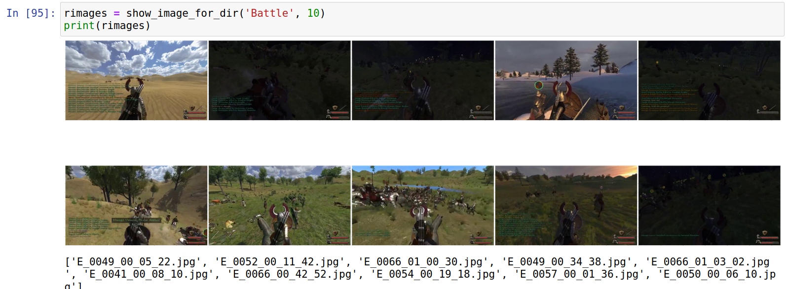

# AUTOMATIC SPLITTING OF VIDEO GAMES RECORDINGS

CAPSTONE Project - Machine Learning Engineer Nanodegree - October 2020

## PROBLEM DEFINITION

### BROAD CONTEXT 

During the last few years it has become more and more common to stream on platforms such as Youtube and Twitch while playing video games, or to upload recorded sessions. The volume of videos produced is overwhelming. In many of the video games being streamed there are different types of scenes. Both for content producers and consumers it would be useful to be able to automatically split videos, to find out in what time intervals different types of scenes run. For instance, having as an input the video recording of a Minecraft speedrun, we could be able to produce the time intervals when the game is taking place in the Overworld surface, in caves, in the Nether and the End respectively - the four main settings of this game.

### PROJECT LOCATION & FILES

* Main repository on Github: _https://github.com/diegoami/DA_ML_Capstone_
* Companion project: _https://github.com/diegoami/DA_split_youtube_frames_s3.git_
* Data : _https://da-youtube-ml.s3.eu-central-1.amazonaws.com/_


### PROJECT SCOPE 
 
The game that I have chosen to analyze is _Mount of Blade: Warband_, of which I made several walkthroughs. In this game, I have identified seven types of scenes to which an image belongs:

* BATTLE: any battle taking place in an open field or in a village 
* TOURNAMENT: Tournaments in arena 
* HIDEOUT: the warband assaults a bandit hideout 
* TRAINING: the hero trains in a field or in a village (later remapped to OTHER)
* SIEGE: a town is sieged 
* TRAP: the hero falls into an ambush and must fight their way out (later remapped to BATLE)
* TOWN (escape): escape from the town or castle prison (later remapped to BATTLE)
* OTHER : everything else 

To create a dataset I took some videos from a game walkthrough of mine, the adventures of Wendy. I used the episodes from 41 to 67 from following public playlists on youtube: 

* CNN-Wendy-I: _https://www.youtube.com/playlist?list=PLNP_nRm4k4jfVfQobYTRQAXV_uOzt8Bov_
* CNN-Wendy-II: _https://www.youtube.com/playlist?list=PLNP_nRm4k4jdEQ-OM31xNqeE64svvx-aT_ 

These are the episodes I went through and manually split into scenes. The scenes descriptions can be found in the video descriptions on youtube. 

For instance, in episode 54, I have identified following scenes, of the category "Hideout", "Battle", "Tournament", "Town". All the other parts of the video are categorized as "Other". These lines can be found in the video description.  

- 09:51-12:21 Hideout Tundra Bandits (Failed)
- 18:47-19:44 Battle with Sea Raiders
- 20:50-21:46 Battle with Sea Raiders
- 22:54-23:42 Battle with Sea Raiders
- 34:06-37:44 Tournament won in Tihr
- 38:46-40:48 Town escape for Boyar Vlan 

To prepare the data set, I had set up a companion project under _https://github.com/diegoami/DA_split_youtube_frames_s3/_:
 
This project:

* downloads the relevant videos from youtube, using the *youtube-dl* python library, in a 640x360 format
* extracts at every two seconds a frame and save it an jpeg file, using the *opencv* python library, resizing to the practical format 320x180
* downloads the text from the youtube description and save it along the video ( _metadata_ )
* Copy files to directories named by the image categories.

\newpage

## PROBLEM ANALYSIS

### DATASET ANALYSIS

By means of the companion project, I created first a dataset that I uploaded to a S3 bucket: _https://da-youtube-ml.s3.eu-central-1.amazonaws.com/wendy-cnn/frames/wendy_cnn_frames_data.zip_ (3.2 Gb) and made public.
The amount of images I had generated first, in this way,  was 45710, split in eight categories. 

This was the breakdown of the images I collected over the 8 classes I mentioned above 

* BATTLE: ~13%
* TOURNAMENT: ~14.8%
* HIDEOUT: ~2.5%
* TRAINING: ~1.7%
* SIEGE: ~0.4%
* TRAP: ~0.2%
* TOWN (escape): ~0.2%
* OTHER : ~67.6%

As it can be seen, some categories have few samples, so it was going to be expected that it would be hard to classify them.
A sanity check whether the images are in the correct directory can be done using the notebook _analysis.ipynb_.

For instance battle images should look like that:



### FIRST ITERATION

Notebook: _CNN_First_Iteration.ipynb_

The simplest way I chose to verify whether a model is viable was to start and set up a Convolutional Neural Network in Pytorch, as I was pretty sure that 

* this was pretty much the most sensible way to approach the problem
* I could use standard CNN topologies available in Pytorch
* analyzing the result of the model would give me more information on what I would have to be looking for

Convolutional Neural Network are, as a matter of fact, a very standard approach for categorizing images. A simple to use and flexible topology I decided to use was VGG, which is included in the Pytorch library. 

As the images extracted from game walkthroughs are not related to real world images, using a pre-trained net and expanding it with transfer learning did not seem a sensible approach. Instead, I opted for a full train.

In the pre-processing phase, in this iteration, I resized images to 128 x 72, which should be enough for the algorithm to recognize features ( original images were all 640 x 360). As I already have over 45000 images, I thought I would do not need any kind of data augmentation (like, use mirrored images), also because it is not given that the game may actually show mirrored images.

I decided to split the dataset into train and validation set dynamically while training. I did not set aside an holdout dataset, as I was planning to use following episodes for testing, which are not in the dataset yet. 

The flaw in the dataset, regrettably, is that some categories, such as *Siege*, *Trap* and *Town*, have relatively few samples. In the confusion matrix there were however some surprises. 


Confusion Matrix
 
| X| 0    | 1   | 2   | 3   | 4   | 5   | 6   | 7   | 
|--|------|-----|-----|-----|-----|-----|-----|-----|
| 0|  5671|    9|   93|    1|   19|    0|    1|    0|
| 1|    59| 1041|   49|    1|    3|    0|    0|    0|
| 2|   315|   19|30312|    1|  156|    0|   77|    0|
| 3|    26|    2|    2|  164|    0|    0|    0|    0|
| 4|    67|    7|  290|    1| 6401|    0|    4|    0|
| 5|    17|    0|   40|    0|    0|    3|    0|    0|
| 6|     8|    1|  175|    0|   49|    0|  537|    0|
| 7|    13|    1|   62|    0|    1|    4|    0|    8|
  
\newpage


  |class| class_name |precision|recall |f1-score|   support |
  |-----|------------|---------|-------|--------|---------- |
  | 0   | Battle     |  0.92   |0.98   | 0.95   |       5974|
  | 1   | Hideout    |  0.96   |0.90   | 0.93   |       1153|
  | 2   | Other      |  0.98   |0.98   | 0.98   |      30880|
  | 3   | Siege      |  0.98   |0.85   | 0.91   |        194|
  | 4   | Tournament |  0.97   |0.95   | 0.98   |       6770|
  | 5   | Trap       |  0.43   |0.05   | 0.09   |         60|
  | 6   | Training   |  0.87   |0.70   | 0.77   |        770|
  | 7   | Town       |  1.00   |0.09   | 0.16   |        89 |
  | |avg             |  0.89   |0.69   | 0.72   |      45710|
  | | weighted avg   |  0.97   |0.97   | 0.96   |      45710|
  
with accuracy of 0.97% (regrettably not relevant)

It turned out that the *Siege* class is not that big a problem (as a matter of fact, images belonging to this category are pretty distinctive). However, the classes *Trap*, *Town* and *Training* tended to be misclassified often. After checking the confusion matrix, I decided that it would make sense to remove these three categories, so that the category *Training* is classified as Other (Training is not interesting anyway) while Trap and Town are classified as Battle.

### SECOND ITERATION

First, I make sure to create a second dataset, where I map Trap and Town to Battle, and Training to Other. So that I end up with 5 categories:

* Battle      : 5943 (13.0%) 
* Hideout     : 1153 (2.5%)
* Other       : 31650  (69.2%)
* Siege       : 194 (0.4%)
* Tournament  : 6770 (14.8%)

TOTAL : 45710

I chose a smaller format for the images I save, as 640x480 is  too big for any model I can realistically train. The dataset becomes therefore much smaller: 1.0 Gb and can be found at _https://da-youtube-ml.s3.eu-central-1.amazonaws.com/wendy-cnn/frames/wendy_cnn_frames_data_2.zip_

I noticed that some images in the dataset were misclassified and I tried to fix this with a preprocessing step, while using a GUI tool to find the misclassified images manually, but this approach turned out to be unpractical. 

Now, creating a basic VGG13 net (type B) on the full images, having height x width = 160 x 90, with 5 epochs, and just 5 categories, and then running the model on the full dataset, gives this result:

Accuracy on validation set of 98% and cross entropy loss of 0.005

Confusion Matrix

| X| 0    | 1   | 2   | 3   | 4   | 
|--|------|-----|-----|-----|-----|
| 0|  5878|    6|   44|    6|    9|
| 1|     7| 1131|    3|    9|    3|    
| 2|   299|   23|31231|    3|   94|    
| 3|     1|    1|    1|  191|    0|    
| 4|    10|   30|  171|    3| 6586|    

|class name|class|precision | recall | f1-score |support|
|----------|-----|----------|--------|----------|-------|
| Battle   |    0|      0.95|    0.99|      0.97|   5943|
| Hideout  |    1|      0.97|    0.98|      0.98|   1153|
| Other    |    2|      0.99|    0.99|      0.99|  31650|
| Siege    |    3|      0.91|    0.98|      0.95|    194|
| Tournam  |    4|      0.98|    0.97|      0.98|   6770|
| |macro avg     |      0.96|    0.98|      0.97|  45710|
| |weighted avg  |      0.99|    0.98|      0.98|  45710|


which is a much better result than the first run. I decided that I could keep this model. I describe the third and the last iteration in the "Result" chapter.


## IMPLEMENTATION

I set up scripts and notebooks so that they would work both locally and on Sagemaker. 

A pytorch/conda environment, as the one in Sagemaker, is assumed - the missing libaries from the default sagemaker conda pytorch environment are in the _/requirements.txt_ file. 

The code root directory is _letsplay_classifier_ - scripts should be executed from this directory, or the directory should be included in PYTHONPATH.

### REQUIRED ENVIRONMENT VARIABLES

All scripts require following environment variables, which are the ones required by Sagemaker containers.

* SM_CHANNEL_TRAIN: location of data - the directory where you unzipped the required data
* SM_MODEL_DIR: where to save the model 
* SM_HOSTS: should be "[]"
* SM_CURRENT_HOST: should be ""

### TRAINING SCRIPT

The training script  _train.py_ accepts following arguments:

* img-width: width to which resize images
* img-height: height to which resize images
* epochs: for how many epochs to train
* batch-size: size of the batch while training
* layer-cfg: what type of VGG net to use (A, B, C or D)

These are the steps that are executed:

* use an image loader from pytorch to create a generator scanning all files in the data directory. 
* use a pytorchvision transformer to resize images
* divide the dataset in train and validation sets, using stratification and shuffling
* load a VGG neural network, modified so that the output layers produce a category from our domain (5 categories in the final version)
* For each epoch, execute a training step and evaluation step, trying to minimize the cross entropy loss in the validation set
* Save the model so that it can be further used by the following steps
 
The cross entropy is the most useful metrics while training a classifier with C classes, therefore it is used here.

### VERIFICATION SCRIPT

The verification script  _verify_model.py_ works only locally, as it assumes the model and the dataset is saved locally from the previous step. It requires the same environment variables as the training script.

* Loads the model created in the previous step
* Walks through all the images in the dataset, one by one, and retrieved the predicted label
* Print average accuracy, a classification report based on discrepancies, a confusion matrix, and a list of images whose predicted category does not coincide with their labels, so that they can be checked.


### MISCLASSIFIED IMAGES


I found out that there were images in the training / validation set that were misclassified. At first I tried correcting the dataset using a GUI, where I would correct images that were classified wrongly according to _verify_model.py_, and save this information so that images could be moved to the correct place. I dropped this approach aas it turned out require a lot of overhead and was error-prone.

I decided instead to have the suspiciously classified images printed from _verify_model.py_, and correct the data at the source, in the video metadata and description. This way I found out a bug in the way I was generating frames (as I was consistently misclassifying the first and last frame) and improved the training dataset.


### PREDICTOR

The file _predict.py_ contains the methods that are necessary to deploy the model to an endpoint. It works both locally and on a Sagemaker container and requires a previously trained model.

* input_fn: this is be the endpoint entry point, which converts a JSON payload to a Pillow Image
* model_fn: predicts a category using a previously trained model, from an image in the domain space (a screenshot from *Mount&Blade: Warband* in format 320 x 180)
* output_fn: returns the model output as a list of log probabilites for each class 


### ENDPOINT 

The file _endpoint.py_ contains a method to call an endpoint on Sagemaker, to collect predictions, to show a classification report and a confusion matrix. It requires locally saved data, but the model is accessed through a published endpoint, unlike the _verify_model.py_ component which requires a saved model locally.

_endpoint.py_ works only in Sagemaker, when called from a Jupyter Notebook. Examples can be seen in the jupyter notebooks, for instance in CNN_Third_iteration.ipynb

### JUPYTER NOTEBOOKS

These are the jupyter notebooks I created while making this project:

* _analysis.ipynb_: just to analyse data
* _CNN_First_Iteration.ipynb_ : First iteration with 8 classes 
* _CNN_Second_Iteration.ipynb_ : Second iteration with 5 classes and some corrections in the data set 
* _CNN_Third_Iteration.ipynb_ : Third iteration with more correction, a more advanced model and verification how the model splits videos 

## RESULTS

In the end, I opted for a VGG13 model (layer configuration "B" in pytorch) trained on full image size (320 x 180). 
I used for that a corrected version of the dataset (_https://da-youtube-ml.s3.eu-central-1.amazonaws.com/wendy-cnn/frames/wendy_cnn_frames_data_2b.zip_) with fewer misclassified images.
The results refer to runs I executed locally on my computer. On Sagemaker the results are somewhat different, as can be seen in the _CNN_Third_iteration.ipynb_ notebook, but I could not figure out why.

### IMAGE CLASSIFICATION
 
When training for 5 epochs, this approach gives a 98.5 % accuracy and a cross entropy loss of 0.0035 both on train and validation set. The improvements are due both to cleaning the dataset and using a bigger format for images.

Classification report on full dataset: 
Accuracy = 0.99

|class name|class|precision | recall | f1-score |support|
|----------|-----|----------|--------|----------|-------|
| Battle   |    0|      0.97|    0.99|      0.98|   6125|
| Hideout  |    1|      0.99|    0.97|      0.98|   1162|
| Other    |    2|      0.99|    0.99|      0.99|  31430|
| Siege    |    3|      0.85|    0.99|      0.92|    195|
| Tournam  |    4|      0.99|    0.97|      0.98|   6798|
| |macro avg     |      0.96|    0.98|      0.97|  45710|
| |weighted avg  |      0.99|    0.99|      0.99|  45710|

Confusion Matrix

| X| 0    | 1   | 2   | 3   | 4   | 
|--|------|-----|-----|-----|-----|
| 0|  6055|    0|   55|    8|    7|
| 1|     4| 1131|    5|   22|    0|    
| 2|   153|   13|31212|    2|   50|    
| 3|     0|    0|    1|  194|    0|    
| 4|    8 |   2 |  197|    1| 6590|    


### INTERVAL IDENTIFICATION

However, this is not the only result I was striving for. I wanted to create a tool not just to categorize images, but to split videos in scenes. Now, this problem would be worth a project in itself, possibly building a model on top of another model, or maybe considering RNN. At the moment I think this would make the problem too complex, as I expect this tool just to be able to help redact description, and not create them without human supervision. 

To find scenes in videos I created an *intervals predictor* script that I could use locally (_predict_intervals_walkdir_), and one that I could use on Sagemaker: _predict_intervals_endpoint_) .
I applied to the next episode in the playlist, E67, that isn't still part of the dataset. 
 
The first generated output is a visualization on how the model classifies each frame. For instance, when a siege scene starts, the following lines are printed out.

```
22:58 ____________________ ____________________
23:00 ____________________ ____________________
23:02 ____________________ ____________________
23:04 __BBSSSSSSSSSSSSSSSS __BBSSSSSSSSSSSSSSSS
23:06 _SSSSSSSSSSSSSSSSSSS _SSSSSSSSSSSSSSSSSSS
23:08 _SSSSSSSSSSSSSSSSSSS _SSSSSSSSSSSSSSSSSSS
23:10 _SSSSSSSSSSSSSSSSSSS _SSSSSSSSSSSSSSSSSSS
....
27:56 _SSSSSSSSSSSSSSSSSSS _SSSSSSSSSSSSSSSSSSS
27:58 _SSSSSSSSSSSSSSSSSSS _SSSSSSSSSSSSSSSSSSS
28:00 _SSSSSSSSSSSSSSSSSSS _SSSSSSSSSSSSSSSSSSS
28:02 _SSSSSSSSSSSSSSSSSSS _SSSSSSSSSSSSSSSSSSS
28:04 ____________________ ____________________
28:06 ____________________ ____________________
```
 
 
Long sequences of frames that are not classified as "other" (battles, sieges, tournaments, hideouts) are clumped together, as they can sometimes be confused with each other. The sequences of frame visualizations become scenes, that I also print along with their time frame intervals.
 
|  INTERVAL         | PREDICTION                                       | REALITY                                |
|-------------------|--------------------------------------------------|----------------------------------------|
| 23:04-28:04       | Siege : 87%                                      | Siege of Unuzdaq Castle                |
| 42:48-42:52       | Tournament : 85%                                 |                                        |
| 43:44-43:52       | Tournament : 88%                                 |                                        |
| 46:24-47:44       | Battle : 53% , Tournament : 39%                  | Battle with Desert Bandits             |
| 52:28-53:02       | Battle : 53% , Hideout : 26% ,  Siege : 31%      | Trap in Dirigh Abana (Battle)          |
| 54:38-56:00       | Battle : 69% , Tournament : 23%                  | Battle with Boyar Gerluch              |
| 01:03:52-01:05:42 | Battle : 81%                                     | Battle with Steppe Bandits (knockd out)|
| 01:14:00-01:16:36 | Battle : 86%                                     | Battle with Emir Atis                  |
| 01:17:50-01:19:16 | Battle : 90%                                     | Battle with Emir Hamezan               |
| 01:33:12-01:34:22 | Battle : 94%                                     | Battle with Emir Rafard                |
| 01:38:16-01:43:50 | Battle : 83%                                     | Battle with Emir Dashwhal (1)          |
| 01:43:56-01:46:06 | Battle : 84% ,  Tournament : 7%                  | Battle with Emir Dashwhal (2)          |
| 01:49:00-01:50:38 | Battle : 93%                                     | Battle with Emir Ralcha   (1)          |
| 01:50:48-01:53:32 | Battle : 94%                                     | Battle with Emir Ralcha   (2)          |
| 01:55:52-01:57:46 | Battle : 94%                                     | Battle with Emir Azadun                |

There are some discrepancies, but the result is a great help when describing a video. 

## CONCLUSIONS

This project proved to me that it is possible to reliably build a classification model for images extracted from video games playthroughs. I could apply this technique also to other video games.

It also proved that this model can be used to successfully split videos from video games playthrough into scenes, with some postprocessing.

