# MACHINE LEARNING CAPSTONE PROJECT

CAPSTONE Project - Machine Learning Engineer Nanodegree - October 2020

## DEFINITION


### PROJECT OVERVIEW

<!-- Student provides a high-level overview of the project in layman’s terms. Background information such as the problem domain, the project origin, and related data sets or input data is given. -->


During the last few years it has become more and more common to stream on platforms such as Youtube and Twitch while playing video games, or to upload recorded sessions. The volume of videos produced is overwhelming. In many of the video games being streamed there are different types of scenes. Both for content producers and consumers it would be useful to be able to automatically split videos, to find out in what time intervals different types of scenes run. For instance, having as an input the video recording of a Minecraft speedrun, we could be able to produce the time intervals when the game is taking place in the Overworld surface, in caves, in the Nether and the End respectively - the four main settings of this game.


The game that I have chosen to analyze is _Mount of Blade: Warband_, of which I made several walkthroughs. This is a game where you spend most of the time on a "strategic map", taking your warband to any of the towns or villages, following or running away from other warbands which can belong to friendly or rival factions, or looking for quest objectives. 

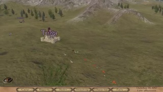
 
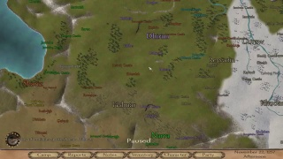

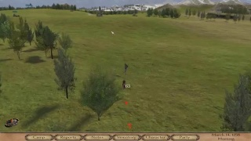

Other in-game screenshots can show the character's inventory, warband composition, allow interaction with in-game characters, display status messages...

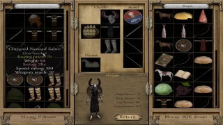

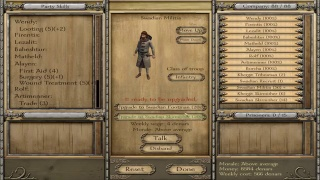

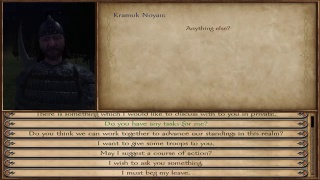

The hero can also take a walk in town, villages and castles. 

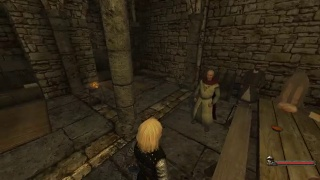

... have training sessions with soldiers...

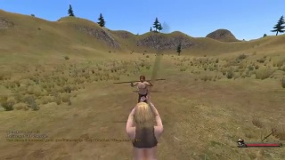
 
    
However, what we are interested in is locating the scenes when the warband engages enemies and the game switches to a tactical view, such as a battle in an open field or in a village...

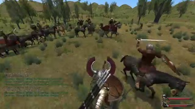

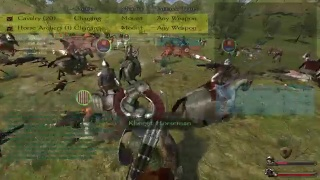

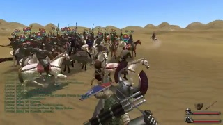

or a sieges to a town or a castle...

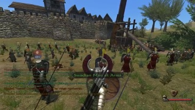

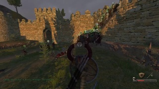


or an assault to a bandit hideout, on foot.

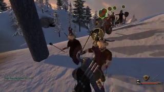

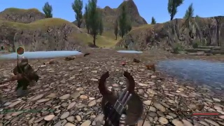

The hero often takes also part in tournaments.

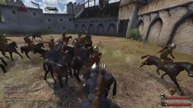

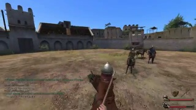

The scene that are most challenging to recognize are quests and ambushes, as they are pretty infrequent and the screenshots may look similar to more peaceful situations. For instance, screenshots from a scene when the hero is rescuing a lord from prison are not very different from scenes when he might be just taking a stroll in the town.

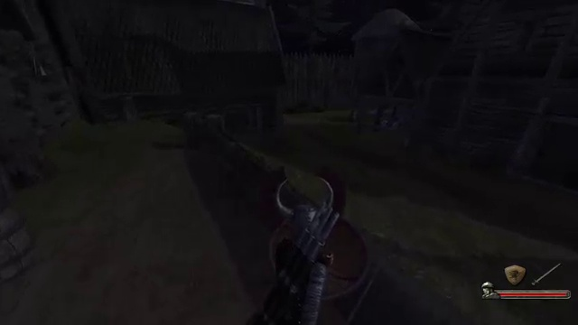
 

### PROBLEM STATEMENT

<!-- The problem which needs to be solved is clearly defined. A strategy for solving the problem, including discussion of the expected solution, has been made. -->

The goal is to create and deploy a model which is able to classify images from the game _Mount&Blade: Warband_ and return a category, such as "Battle", "Hideout", "Siege", "Tournament" and "Other". It is also desirable to find out an optimal number of categories. It would be ideal to have categories for less frequent scenes such as "Prison escape", "Ambush", "Quest", but this will be out of scope and such scenes will be lumped together with the closes "main" category.

An additional goal is to have a model which identifies contiguous scenes in a gameplay video of _Mount&Blade: Warband_, providing the beginning and the end of the scenes, and its category.

A necessary requirement for this project is to gather a dataset of screenshots taken from the game, as well as the category to which they belong.

### METRICS

<!-- Metrics used to measure the performance of a model or result are clearly defined. Metrics are justified based on the characteristics of the problem. -->

I will measure the performance of the image classifier using accuracy and cross-entropy loss on the training, validation and test (holdout) dataset. 

I will also measure precision, recall, accuracy and F1 for each category,  as well as a total weighted and mean accuracy. I will also provide a confusion matrix.

## ANALYSIS

### DATA EXPLORATION

<!-- If a dataset is present, features and calculated statistics relevant to the problem have been reported and discussed, along with a sampling of the data. In lieu of a dataset, a thorough description of the input space or input data has been made. Abnormalities or characteristics of the data or input that need to be addressed have been identified.  -->

#### CREATING A DATASET

To create a dataset I took some videos from a game walkthrough of mine, the adventures of Wendy. I used the episodes from 41 to 69 from following public playlists on youtube: 

* CNN-Wendy-I: _https://www.youtube.com/playlist?list=PLNP_nRm4k4jfVfQobYTRQAXV_uOzt8Bov_
* CNN-Wendy-II: _https://www.youtube.com/playlist?list=PLNP_nRm4k4jdEQ-OM31xNqeE64svvx-aT_ 

I found scenes in these episodes and added scene descriptions, that can be found in the video descriptions on youtube. 

For instance, in episode 54, I have identified following scenes, of the category "Hideout", "Battle", "Tournament", "Town" ("Town" is eventually remapped to "Battle"). All the other parts of the video are categorized as "Other". These lines can be found in the video description.  

* 09:51-12:21 Hideout Tundra Bandits (Failed)
* 18:47-19:44 Battle with Sea Raiders
* 20:50-21:46 Battle with Sea Raiders
* 22:54-23:42 Battle with Sea Raiders
* 34:06-37:44 Tournament won in Tihr
* 38:46-40:48 Town escape for Boyar Vlan 

#### COMPANION PROJECTS

To prepare the data set, I had set up a companion project under _https://github.com/diegoami/DA_split_youtube_frames_s3/_. 

 
This project:

* downloads the relevant videos from youtube, using the *youtube-dl* python library, in a 640x360 format
* extracts at every two seconds a frame and save it an jpeg file, using the *opencv* python library, resizing to the practical format 320x180
* downloads the text from the youtube description and save it along the video ( _metadata_ )
* Copy files to directories named by the image categories.

#### DATASET CHARACTERISTICS

The dataset contains 51216 images , 320 x 190, in jpeg format, categorized in this way

|    | Category   |  Amount  | Percentage |
|----|------------|----------|------------|
|    | Battle     |      7198|      14.0% |
|    | Hideout    |      1163|       2.2% |
|    | Other      |     35425|      67.4% |
|    | Siege      |       634|       1.2% |
|    | Tournament |      6796|      13.3% |
|    |   TOTAL    |     51216|

You can browse them using the _analysis.ipynb_ notebooks.

### EXPLORATORY VISUALIZATION

<!-- A visualization has been provided that summarizes or extracts a relevant characteristic or feature about the dataset or input data with thorough discussion. Visual cues are clearly defined. -->

This is a PCA representation of the features of the images dataset recovered from the last layer of a VGG13 model on the dataset.

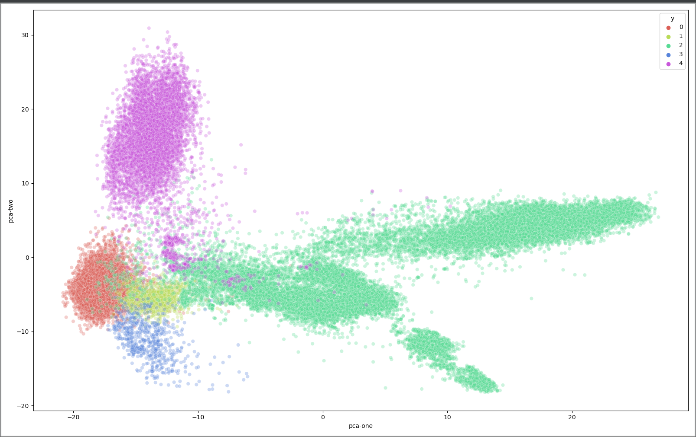

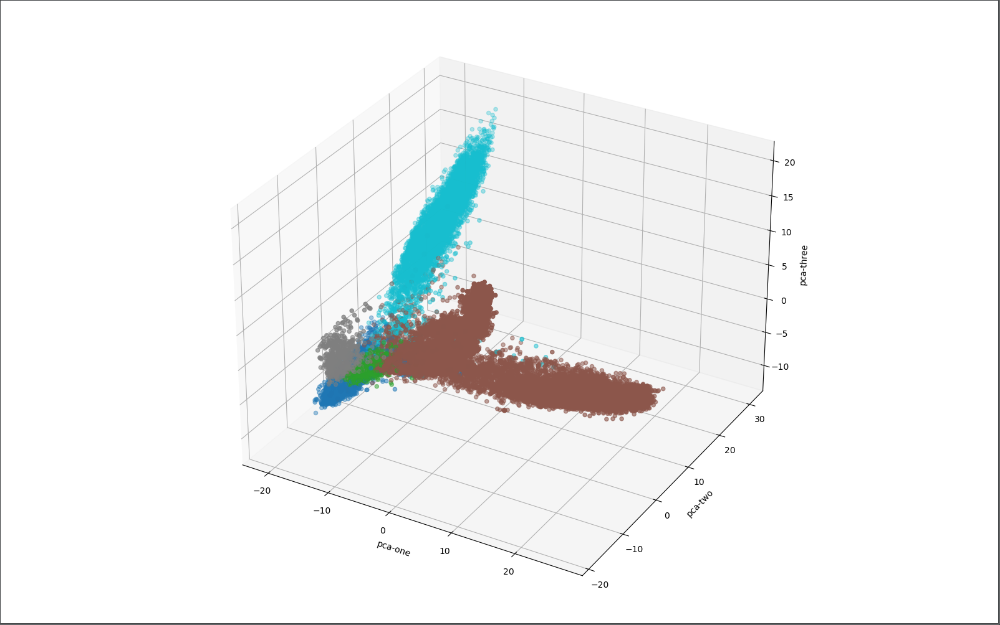

It can be seen that the class do show some distinction. There is some overlap between

* Other --> Tournament: possibly Arena and Training scenes (categorized as Other, they are similar to Tournaments)
* Battle --> Other : possibly Town escapes and Ambushes (categorized as Battle, but look like scenes in which the hero is strolling)

There is not much to do about that as we have too few images that we could categorize as Arena, Ambush, Training... and we will accept that those frames may confuse the model.

### ALGORITHMS AND TECHNIQUES

<!-- Algorithms and techniques used in the project are thoroughly discussed and properly justified based on the characteristics of the problem. -->

#### GENERAL APPROACH


The simplest way I chose to verify whether a model is viable was to start and set up a Convolutional Neural Network in Pytorch, as I was pretty sure that 

* this was pretty much the most sensible way to approach the problem
* I could use standard CNN topologies available in Pytorch
* analyzing the result of the model would give me more information on what I would have to be looking for

Convolutional Neural Network are, as a matter of fact, a very standard approach for categorizing images. A simple to use and flexible topology I decided to use was VGG, which is included in the Pytorch library. 

As the images extracted from game walkthroughs are not related to real world images, using a pre-trained net and expanding it with transfer learning did not seem a sensible approach. Instead, I opted for a full train.

In the pre-processing phase, I keep images to their original size 320 x 180. Resizing to a smaller size gave worse result. As I already have over 50000 images, I do not need any kind of data augmentation such as  mirrored images, also because the game may not produce mirrored images.


I decided not to split the dataset into train, validation and test set, and to this split dynamically while training the model. As the dataset is expected to keep growing while I am going to add new videos and new frames, this was done to simplify dataset management.

#### MODELS

I chose to use Pytorch and the models that it includes 

### BENCHMARK

<!-- Student clearly defines a benchmark result or threshold for comparing performances of solutions obtained. -->

As 67.4 % of the images belong to the category "Other", a model should have an accuracy of at least 68% for being considered better than a model that always pick the Category "Other"


## METHODOLOGY

### DATA PROCESSING

<!-- All preprocessing steps have been clearly documented. Abnormalities or characteristics of the data or input that needed to be addressed have been corrected. If no data preprocessing is necessary, it has been clearly justified. -->


### IMPLEMENTATION

<!-- The process for which metrics, algorithms, and techniques were implemented with the given datasets or input data has been thoroughly documented. Complications that occurred during the coding process are discussed. -->

### REFINEMENT

<!-- The process of improving upon the algorithms and techniques used is clearly documented. Both the initial and final solutions are reported, along with intermediate solutions, if necessary. -->

## RESULTS

### MODEL EVALUATION AND VALIDATION

<!-- The final model’s qualities—such as parameters—are evaluated in detail. Some type of analysis is used to validate the robustness of the model’s solution. -->

### JUSTIFICATION

<!-- The final results are compared to the benchmark result or threshold with some type of statistical analysis. Justification is made as to whether the final model and solution is significant enough to have adequately solved the problem. -->

### REQUIRED ENVIRONMENT VARIABLES

All scripts require following environment variables, which are the ones required by Sagemaker containers.

* SM_CHANNEL_TRAIN: location of data - the directory where you unzipped the required data
* SM_MODEL_DIR: where to save the model 
* SM_HOSTS: should be "[]"
* SM_CURRENT_HOST: should be ""

### TRAINING SCRIPT

The training script  _train.py_ accepts following arguments:

* img-width: width to which resize images
* img-height: height to which resize images
* epochs: for how many epochs to train
* batch-size: size of the batch while training
* layer-cfg: what type of VGG net to use (A, B, C or D)

These are the steps that are executed:

* use an image loader from pytorch to create a generator scanning all files in the data directory. 
* use a pytorchvision transformer to resize images
* divide the dataset in train and validation sets, using stratification and shuffling
* load a VGG neural network, modified so that the output layers produce a category from our domain (5 categories in the final version)
* For each epoch, execute a training step and evaluation step, trying to minimize the cross entropy loss in the validation set
* Save the model so that it can be further used by the following steps
 
The cross entropy is the most useful metrics while training a classifier with C classes, therefore it is used here.

### VERIFICATION SCRIPT

The verification script  _verify_model.py_ works only locally, as it assumes the model and the dataset is saved locally from the previous step. It requires the same environment variables as the training script.

* Loads the model created in the previous step
* Walks through all the images in the dataset, one by one, and retrievea the predicted label
* Print average accuracy, a classification report based on discrepancies, a confusion matrix, and a list of images whose predicted category does not coincide with their labels, so that they can be checked.


### MISCLASSIFIED IMAGES


I found out that there were images in the training / validation set that were misclassified. At first I tried correcting the dataset using a GUI, where I would correct images that were classified wrongly according to _verify_model.py_, and save this information so that images could be moved to the correct place. I dropped this approach aas it turned out require a lot of overhead and was error-prone.

I decided instead to have the suspiciously classified images printed from _verify_model.py_, and correct the data at the source, in the video metadata and description. This way I found out a bug in the way I was generating frames (as I was consistently misclassifying the first and last frame) and improved the training dataset.


### PREDICTOR

The file _predict.py_ contains the methods that are necessary to deploy the model to an endpoint. It works both locally and on a Sagemaker container and requires a previously trained model.

* input_fn: this is be the endpoint entry point, which converts a JSON payload to a Pillow Image
* model_fn: predicts a category using a previously trained model, from an image in the domain space (a screenshot from *Mount&Blade: Warband* in format 320 x 180)
* output_fn: returns the model output as a list of log probabilites for each class 


### ENDPOINT 

The file _endpoint.py_ contains a method to call an endpoint on Sagemaker, to collect predictions, to show a classification report and a confusion matrix. It requires locally saved data, but the model is accessed through a published endpoint, unlike the _verify_model.py_ component which requires a saved model locally.

_endpoint.py_ works only in Sagemaker, when called from a Jupyter Notebook. Examples can be seen in the jupyter notebooks, for instance in CNN_Third_iteration.ipynb

### JUPYTER NOTEBOOKS

These are the jupyter notebooks I created while making this project:

* _analysis.ipynb_: just to analyse data
* _CNN_First_Iteration.ipynb_ : First iteration with 8 classes 
* _CNN_Second_Iteration.ipynb_ : Second iteration with 5 classes and some corrections in the data set 
* _CNN_Third_Iteration.ipynb_ : Third iteration with more correction, a more advanced model and verification how the model splits videos 

## RESULTS

In the end, I opted for a VGG13 model (layer configuration "B" in pytorch) trained on full image size (320 x 180). 
I used for that a corrected version of the dataset (_https://da-youtube-ml.s3.eu-central-1.amazonaws.com/wendy-cnn/frames/wendy_cnn_frames_data_2b.zip_) with fewer misclassified images.
The results refer to runs I executed locally on my computer. On Sagemaker the results are somewhat different, as can be seen in the _CNN_Third_iteration.ipynb_ notebook, but I could not figure out why.

### IMAGE CLASSIFICATION
 
When training for 5 epochs, this approach gives a 98.5 % accuracy and a cross entropy loss of 0.0035 both on train and validation set. The improvements are due both to cleaning the dataset and using a bigger format for images.

Classification report on full dataset: 
Accuracy = 0.99

|class name|class|precision | recall | f1-score |support|
|----------|-----|----------|--------|----------|-------|
| Battle   |    0|      0.97|    0.99|      0.98|   6125|
| Hideout  |    1|      0.99|    0.97|      0.98|   1162|
| Other    |    2|      0.99|    0.99|      0.99|  31430|
| Siege    |    3|      0.85|    0.99|      0.92|    195|
| Tournam  |    4|      0.99|    0.97|      0.98|   6798|
| |macro avg     |      0.96|    0.98|      0.97|  45710|
| |weighted avg  |      0.99|    0.99|      0.99|  45710|

Confusion Matrix

| X| 0    | 1   | 2   | 3   | 4   | 
|--|------|-----|-----|-----|-----|
| 0|  6055|    0|   55|    8|    7|
| 1|     4| 1131|    5|   22|    0|    
| 2|   153|   13|31212|    2|   50|    
| 3|     0|    0|    1|  194|    0|    
| 4|    8 |   2 |  197|    1| 6590|    


### INTERVAL IDENTIFICATION

However, this is not the only result I was striving for. I wanted to create a tool not just to categorize images, but to split videos in scenes. Now, this problem would be worth a project in itself, possibly building a model on top of another model, or maybe considering RNN. At the moment I think this would make the problem too complex, as I expect this tool just to be able to help redact description, and not create them without human supervision. 

To find scenes in videos I created an *intervals predictor* script that I could use locally (_predict_intervals_walkdir_), and one that I could use on Sagemaker: _predict_intervals_endpoint_) .
I applied to the next episode in the playlist, E67, that isn't still part of the dataset. 
 
The first generated output is a visualization on how the model classifies each frame. For instance, when a siege scene starts, the following lines are printed out.

```
22:58 ____________________ ____________________
23:00 ____________________ ____________________
23:02 ____________________ ____________________
23:04 __BBSSSSSSSSSSSSSSSS __BBSSSSSSSSSSSSSSSS
23:06 _SSSSSSSSSSSSSSSSSSS _SSSSSSSSSSSSSSSSSSS
23:08 _SSSSSSSSSSSSSSSSSSS _SSSSSSSSSSSSSSSSSSS
23:10 _SSSSSSSSSSSSSSSSSSS _SSSSSSSSSSSSSSSSSSS
....
27:56 _SSSSSSSSSSSSSSSSSSS _SSSSSSSSSSSSSSSSSSS
27:58 _SSSSSSSSSSSSSSSSSSS _SSSSSSSSSSSSSSSSSSS
28:00 _SSSSSSSSSSSSSSSSSSS _SSSSSSSSSSSSSSSSSSS
28:02 _SSSSSSSSSSSSSSSSSSS _SSSSSSSSSSSSSSSSSSS
28:04 ____________________ ____________________
28:06 ____________________ ____________________
```
 
 
Long sequences of frames that are not classified as "other" (battles, sieges, tournaments, hideouts) are clumped together, as they can sometimes be confused with each other. The sequences of frame visualizations become scenes, that I also print along with their time frame intervals.
 
|  INTERVAL         | PREDICTION                                       | REALITY                                |
|-------------------|--------------------------------------------------|----------------------------------------|
| 23:04-28:04       | Siege : 87%                                      | Siege of Unuzdaq Castle                |
| 42:48-42:52       | Tournament : 85%                                 |                                        |
| 43:44-43:52       | Tournament : 88%                                 |                                        |
| 46:24-47:44       | Battle : 53% , Tournament : 39%                  | Battle with Desert Bandits             |
| 52:28-53:02       | Battle : 53% , Hideout : 26% ,  Siege : 31%      | Trap in Dirigh Abana (Battle)          |
| 54:38-56:00       | Battle : 69% , Tournament : 23%                  | Battle with Boyar Gerluch              |
| 01:03:52-01:05:42 | Battle : 81%                                     | Battle with Steppe Bandits (knockd out)|
| 01:14:00-01:16:36 | Battle : 86%                                     | Battle with Emir Atis                  |
| 01:17:50-01:19:16 | Battle : 90%                                     | Battle with Emir Hamezan               |
| 01:33:12-01:34:22 | Battle : 94%                                     | Battle with Emir Rafard                |
| 01:38:16-01:43:50 | Battle : 83%                                     | Battle with Emir Dashwhal (1)          |
| 01:43:56-01:46:06 | Battle : 84% ,  Tournament : 7%                  | Battle with Emir Dashwhal (2)          |
| 01:49:00-01:50:38 | Battle : 93%                                     | Battle with Emir Ralcha   (1)          |
| 01:50:48-01:53:32 | Battle : 94%                                     | Battle with Emir Ralcha   (2)          |
| 01:55:52-01:57:46 | Battle : 94%                                     | Battle with Emir Azadun                |

There are some discrepancies, but the result is a great help when describing a video. 

## CONCLUSIONS

This project proved to me that it is possible to reliably build a classification model for images extracted from video games playthroughs. I could apply this technique also to other video games.

It also proved that this model can be used to successfully split videos from video games playthrough into scenes, with some postprocessing.

