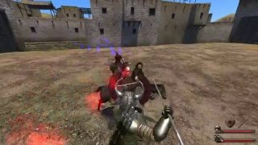

# MACHINE LEARNING CAPSTONE PROJECT

CAPSTONE Project - Machine Learning Engineer Nanodegree - October 2020

Project location : https://github.com/diegoami/DA_ML_Capstone

## DEFINITION

### PROJECT OVERVIEW

<!-- Student provides a high-level overview of the project in layman’s terms. Background information such as the problem domain, the project origin, and related data sets or input data is given. -->


During the last few years it has become more and more common to stream on platforms such as Youtube and Twitch while playing video games, or to upload recorded sessions. The volume of videos produced is overwhelming. In many of the video games being streamed there are different types of scenes. Both for content producers and consumers it would be useful to be able to automatically split videos, to find out in what time intervals different types of scenes run. For instance, having as an input the video recording of a Minecraft speedrun, we could be able to produce the time intervals when the game is taking place in the Overworld surface, in caves, in the Nether and the End respectively - the four main settings of this game.


The game that I have chosen to analyze is _Mount of Blade: Warband_, of which I made several walkthroughs. This is a game where you spend most of the time on a "strategic map", taking your warband to any of the towns or villages, following or running away from other warbands which can belong to friendly or rival factions, or looking for quest objectives. 


 


Other in-game screenshots can show the character's inventory, warband composition, allow interaction with in-game characters, display status messages...


The hero can also take a walk in town, villages and castles. 


... have training sessions with soldiers...


or spar in arena with them as well.
 
    
However, what we are interested in is locating the scenes when the warband engages enemies and the game switches to a tactical view, such as a battle in an open field or in a village...


or a sieges to a town or a castle...


or an assault to a bandit hideout, on foot.


The hero often can also take part in tournaments, which are an important part of the game.


The scene that are most challenging to recognize are quests and ambushes, as they are pretty infrequent and the screenshots may look similar to more peaceful situations. For instance, screenshots from a scene when the hero is rescuing a lord from prison are not very different from scenes when he might be just taking a stroll in the town.


 ... or scenes when the hero is training his troops or sparring with them in the arena may be confused with Tournament scenes. 
 


### PROBLEM STATEMENT

<!-- The problem which needs to be solved is clearly defined. A strategy for solving the problem, including discussion of the expected solution, has been made. -->

The goal is to create and deploy a model which is able to classify images from the game _Mount&Blade: Warband_ and return a category, such as "Battle", "Hideout", "Siege", "Tournament" and "Other". It is also desirable to find out an optimal number of categories. It would be ideal to have categories for less frequent scenes such as "Prison escape", "Ambush", "Quest", but this will be out of scope and such scenes will be lumped together with the closes "main" category.

An additional goal is to have a model which identifies contiguous scenes in a gameplay video of _Mount&Blade: Warband_, providing the beginning and the end of the scenes, and its category.

A necessary requirement for this project is to gather a dataset of screenshots taken from the game, as well as the category to which they belong.

### METRICS

<!-- Metrics used to measure the performance of a model or result are clearly defined. Metrics are justified based on the characteristics of the problem. -->

I will measure the performance of the image classifier using accuracy and cross-entropy loss on the training, validation and test (holdout) dataset. 

I will also measure precision, recall, accuracy and F1 for each category,  as well as a total weighted and mean accuracy. I will also provide a confusion matrix for each class. 

## ANALYSIS

### DATA EXPLORATION

<!-- If a dataset is present, features and calculated statistics relevant to the problem have been reported and discussed, along with a sampling of the data. In lieu of a dataset, a thorough description of the input space or input data has been made. Abnormalities or characteristics of the data or input that need to be addressed have been identified.  -->

#### CREATING A DATASET

To create a dataset I took some videos from a game walkthrough of mine, the adventures of Wendy. I used the episodes from 41 to 68 from following  playlists on youtube: 

* CNN-Wendy-I: _https://www.youtube.com/playlist?list=PLNP_nRm4k4jfVfQobYTRQAXV_uOzt8Bov_
* CNN-Wendy-II: _https://www.youtube.com/playlist?list=PLNP_nRm4k4jdEQ-OM31xNqeE64svvx-aT_ 
* CNN-Wendy-III: _https://www.youtube.com/playlist?list=PLNP_nRm4k4jdEQ-OM31xNqeE64svvx-aTPLNP_nRm4k4jeoJ8H7mtTUbbOJ6_Rx_god_

I found scenes in these episodes and added scene descriptions, that can be found in the video descriptions on youtube. 

For instance, in episode 54, I have identified following scenes, of the category "Hideout", "Battle", "Tournament", "Town" ("Town" is eventually remapped to "Battle"). All the other parts of the video are categorized as "Other". These lines can be found in the video description.  

* 09:51-12:21 Hideout Tundra Bandits (Failed)
* 18:47-19:44 Battle with Sea Raiders
* 20:50-21:46 Battle with Sea Raiders
* 22:54-23:42 Battle with Sea Raiders
* 34:06-37:44 Tournament won in Tihr
* 38:46-40:48 Town escape for Boyar Vlan 

#### COMPANION PROJECTS

To prepare the data set, I had set up a companion project under _https://github.com/diegoami/DA_split_youtube_frames_s3/_. 

 
This project:

* downloads the relevant videos from youtube, using the *youtube-dl* python library, in a 640x360 format
* extracts at every two seconds a frame and save it an jpeg file, using the *opencv* python library, resizing to the practical format 320x180
* downloads the text from the youtube description and save it along the video ( _metadata_ )
* Copy files to directories named by the image categories.

The result of this process has been uploaded to Amazon S3. Files can be browsed here: https://da-youtube-ml.s3.eu-central-1.amazonaws.com/ 


#### DATASET CHARACTERISTICS

The dataset contains 51216 images , 320 x 190, in jpeg format, categorized in this way

|    | Category   |  Amount  | Percentage |
|----|------------|----------|------------|
|    | Battle     |      7198|      14.0% |
|    | Hideout    |      1163|       2.2% |
|    | Other      |     35425|      67.4% |
|    | Siege      |       634|       1.2% |
|    | Tournament |      6796|      13.3% |
|    |   TOTAL    |     51216|

You can browse them using the _analysis.ipynb_ notebooks.
Browsing images I found out that grayscale informati

### EXPLORATORY VISUALIZATION

<!-- A visualization has been provided that summarizes or extracts a relevant characteristic or feature about the dataset or input data with thorough discussion. Visual cues are clearly defined. -->
Using PCA on a flattened version of the image matrixes, in format 80x45, black and white, I produced visualizations in 2d of the dataset.


and here in 3d, using the same color scheme.


It can be seen that "Other" scenes are separated in several clusters. "Battle", "Tournament", "Siege" and "Hideout" images do group in certain regions, but there is a lot of overlap beween each other and with some of the "Other" images.

We move on to create a VGG13 model and do a PCA representation of the features of the images dataset recovered from the last layer .


Here there are is much less overlap between regions where the different classes are located. That shows how the new created features are important for the categorization task.

* Other --> Tournament: possibly Arena and Training scenes (categorized as Other, they are similar to Tournaments)
* Battle --> Other : possibly Town escapes and Ambushes (categorized as Battle, but look like scenes in which the hero is strolling)

There is not much to do about that as we have too few images that we could categorize as Arena, Ambush, Training... and we will accept that those frames may confuse the model.

### ALGORITHMS AND TECHNIQUES

<!-- Algorithms and techniques used in the project are thoroughly discussed and properly justified based on the characteristics of the problem. -->

#### GENERAL APPROACH


The general idea is to create an image classifier to categorize the images extracted from gameplay videos as belonging to a particular type of scenes. Then to use this image classifier on frames extracted from other gameplay vidoes to identify how to split videos into scenese.

For the Image Classifier I choose to start with one of the Convolutional Neural Network which are already available in Pytorch, as  

* this is a well-tried way to approach the problem 
* I could use standard CNN topologies available in Pytorch, such as VGG, which would als not require too much memory
* analyzing the result of the model would give me more information on what I would have to be looking for

 A simple to use and flexible topology I decided to use was VGG, which is powerful enough and small enough to fit on the GPU I used for training.

As the images extracted from game walkthroughs are not related to real world images, using a pre-trained net and expanding it with transfer learning did not seem a sensible approach. Instead, I opted for a full train.


#### MODELS

The approach I considered most simple and promising was to use Convolutional Neural Network included in the torchvision package in Pytorch.

I ended up using the VGG13 Model, which gives satisfying results while also not being overbloated.

### BENCHMARK

<!-- Student clearly defines a benchmark result or threshold for comparing performances of solutions obtained. -->

As 67.4 % of the images belong to the category "Other", a model should have an accuracy of at least 68% for being considered better than a model that always pick the Category "Other".

Other than that, I create a very simple model that would use flattened matrixes of images, possibly in greyscale, using standard scikit-learn transformers and PCA.

Using greyscale images in 80x45 format, I got the following results using a RandomTreeForest an SGD on 50 PCA-produced features, on the validation set (which had not been used for training).

It is not surprising that these results do not look that bad at all, and are actually good as separating "Other" images from images depicting any kind of engagement / fight (Tournament, Battle, Siege, Hideout). That is expected, as there are some GUI components that appear only in these scenes.

#### RandomForestClassifier

```
Accuracy (validation) : 0.898
F1 Score (validation) : 0.885
              
                precision    recall  f1-score   support

           0       0.76      0.84      0.80      2375
           1       0.83      0.01      0.03       384
           2       0.97      0.97      0.97     11691
           3       1.00      0.01      0.02       209
           4       0.72      0.82      0.77      2243

    accuracy                           0.90     16902
   macro avg       0.86      0.53      0.52     16902
weighted avg       0.90      0.90      0.88     16902
```
Confusion Matrix
[[ 2150     0    84     0   141]
 [   99    73    27     1   184]
 [  169     0 11400     0   122]
 [   86     0    11    65    47]
 [  101     1    82     0  2059]]

#### SGDClassifier(alpha=0.001, max_iter=10000) 

```
Accuracy: 0.848
F1 Score: 0.848
              precision    recall  f1-score   support

           0       0.56      0.82      0.67      2375
           1       0.71      0.21      0.32       384
           2       0.97      0.93      0.95     11691
           3       0.56      0.20      0.30       209
           4       0.66      0.60      0.63      2243

    accuracy                           0.85     16902
   macro avg       0.69      0.55      0.57     16902
weighted avg       0.86      0.85      0.85     16902
```
[[ 1957    14    66     4   334]
 [  225    79     6     3    71]
 [  479     2 10905    26   279]
 [  135     7     3    42    22]
 [  675     9   211     0  1348]]


## METHODOLOGY

### DATA PROCESSING

<!-- All preprocessing steps have been clearly documented. Abnormalities or characteristics of the data or input that needed to be addressed have been corrected. If no data preprocessing is necessary, it has been clearly justified. -->

The image dataset has been created extracting frames from video on youtube, and putting them in subdirectories named like the category they belong with. This is the main dataset I have been working with. These images have also been resized are in 320 x 180  RGB format , and normalized.

While training the benchmark models, images are transformed into grayscale and resized to 80 x 45, but when training the deep learning models we use the original images in color, 320x180.


 As these images originate from video games,  any kind of data augmentation such as mirrored or cropped images do not make sense. These images would not be produced by the game, as many GUI components are always in the same place.


### IMPLEMENTATION

<!-- The process for which metrics, algorithms, and techniques were implemented with the given datasets or input data has been thoroughly documented. Complications that occurred during the coding process are discussed. -->


I set up scripts and notebooks so that they would work both locally and on Sagemaker. 

A pytorch/conda environment, as the one in Sagemaker, is assumed - the missing libaries from the default sagemaker conda pytorch environment are in the _/requirements.txt_ file. The four environment variables require for Sagemaker,  SM_HOSTS, SM_CHANNEL_TRAIN, SM_MODEL_DIR, SM_CURRENT_HOST, must be set.

The code root directory is _letsplay_classifier_ - scripts should be executed from this directory, and directory should be included in PYTHONPATH.

For more details see the file [README.md](README.md)

#### TRAINING SCRIPT

The training script  _train.py_ accepts following arguments:

* img-width: width to which resize images
* img-height: height to which resize images
* epochs: for how many epochs to train
* batch-size: size of the batch while training
* layer-cfg: what type of VGG net to use (A, B, C or D)

These are the steps that are executed:

* use an image loader from pytorch to create a generator scanning all files in the data directory. 
* use a pytorchvision transformer to resize images
* divide the dataset in train, validation and test sets, using stratification and shuffling
* load a VGG neural network, modified so that the output layers produce a category from our domain (5 categories in the final version)
* For each epoch, execute a training step and evaluation step, trying to minimize the cross entropy loss in the validation set
* Save the model so that it can be further used by the following steps
* Evaluate the produced model on the test dataset, and print classification report and confusion matrix
 
The cross entropy is the most useful metrics while training a classifier with C classes, therefore it is used here.

#### VERIFICATION SCRIPT

The verification script  _verify_model.py_ works only locally, as it assumes the model and the dataset is saved locally from the previous step. It requires the same environment variables as the training script.

* Loads the model created in the previous step
* Walks through all the images in the dataset, one by one, and retrieve the predicted label
* Print average accuracy, a classification report based on discrepancies, a confusion matrix, and a list of images whose predicted category does not coincide with their labels, so that the dataset can be corrected.


#### PREDICTOR

The file _predict.py_ contains the methods that are necessary to deploy the model to an endpoint. It works both locally and on a Sagemaker container and requires a previously trained model.

* input_fn: this is be the endpoint entry point, which converts a Numpy matrix payload to a Pillow Image, applying the same preprocessing steps as during training
* model_fn: predicts a category using a previously trained model, accepting an image from the domain space (a screenshot from *Mount&Blade: Warband* in format 320 x 180) and transformed in the same way as during training
* output_fn: returns the model output as a numpy array: a list of log probabilites for each class 


#### ENDPOINT 

The file _endpoint.py_ contains a method _evaluate_ allowing to call an endpoint on Sagemaker, so that you can  collect predictions, which can be used to show a classification report and a confusion matrix. It requires locally saved data, but the model is accessed through a published endpoint, unlike the _verify_model.py_ component which requires a saved model locally.

_endpoint.py_ works only in Sagemaker, when called from a Jupyter Notebook. Examples can be seen in the jupyter notebooks, for instance in [CNN_Fourth_iteration.ipynb](CNN_Fourth_iteration.ipynb)

#### JUPYTER NOTEBOOKS

These are the jupyter notebooks I created while making this project:

* _analysis.ipynb_: just to browse through images
* _CNN_First_Iteration.ipynb_ : First iteration with 8 classes 
* _CNN_Second_Iteration.ipynb_ : Second iteration with 5 classes and some corrections in the data set 
* _CNN_Third_Iteration.ipynb_ : Third iteration with more corrections, a more advanced model and a first attempt to use the model to split videos 
* *CNN_Third_Iteration.ipynb* : Fourth iteration and final results 

### REFINEMENT

<!-- The process of improving upon the algorithms and techniques used is clearly documented. Both the initial and final solutions are reported, along with intermediate solutions, if necessary. -->

At the beginning I was trying recognize 8 types of scenes. Apart from the categories BATTLE, HIDEOUT, OTHER, SIEGE, TOURNAMENT I had also the categories TOWN, TRAP and TRAINING. But as can be seen in  [CNN_First_Iteration.ipynb](CNN_First_Iteration.ipynb), I had too few amples of these and merged TRAINING into OTHER, while TOWN and TRAP became BATTLE.


Another important refinement was finding images in the dataset that had been wrongly labeled. For this, I used the output from one of my scripts, _verify_model.py_, which pointed to images whose prediction mismatched with labels. The only semnsible way to deal with that was to correct metadata at the source and use the companion project  
*DA_split_youtube_frames_S3* to regenerate frames in the correct directory.

I decided pretty early that my main model would be a VGG implementation in Pytorch.   


## RESULTS

### MODEL EVALUATION AND VALIDATION

<!-- The final model’s qualities—such as parameters—are evaluated in detail. Some type of analysis is used to validate the robustness of the model’s solution. -->

#### IMAGE CLASSIFICATION

The final model uses 512126 images ( 320 x 180 ) in color, VGG13, with 8 epochs. This is the confusion matrix and metrics on the full dataset.    

Confusion matrix

| X| 0    | 1   | 2   | 3   | 4   | 
|--|------|-----|-----|-----|-----|
| 0|  7094|   34|   53|    8|    9|
| 1|     1| 1151|    6|    5|    0|    
| 2|   197|   15|35063|    4|  146|    
| 3|     3|   18|    1|  612|    0|    
| 4|    22|    7|  182|    5| 6580|    

|class name|class|precision | recall | f1-score |support|
|----------|-----|----------|--------|----------|-------|
| Battle   |    0|      0.97|    0.99|      0.98|   7198|
| Hideout  |    1|      0.94|    0.99|      0.96|   1163|
| Other    |    2|      0.99|    0.99|      0.99|  35425|
| Siege    |    3|      0.91|    0.98|      0.95|    194|
| Tournam  |    4|      0.98|    0.97|      0.97|   6796|
| |macro avg     |      0.97|    0.98|      0.97|  51216|
| |weighted avg  |      0.99|    0.99|      0.99|  51216|

When just executed on the test dataset, it returns an accuracy of 98,7% and a cross entropy of 0.0026 and following confusion matrix and classification report


Confusion Matrix

| X| 0    | 1   | 2   | 3   | 4   | 
|--|------|-----|-----|-----|-----|
| 0|  995 |    3|    7|    1|    2|
| 1|     0|  163|    0|    0|    0|    
| 2|    26|    3| 4911|    2|   18|    
| 3|     3|    1|    0|   85|    0|    
| 4|     0|    0|   24|    0|  927|  

|class name|class|precision | recall | f1-score |support|
|----------|-----|----------|--------|----------|-------|
| Battle   |    0|      0.97|    0.99|      0.98|   1008|
| Hideout  |    1|      0.96|    1.00|      0.98|    163|
| Other    |    2|      0.99|    0.99|      0.99|   4960|
| Siege    |    3|      0.97|    0.96|      0.96|     89|
| Tournam  |    4|      0.98|    0.97|      0.98|    951|
| |macro avg     |      0.97|    0.98|      0.98|   7171|
| |weighted avg  |      0.99|    0.99|      0.99|   7171|


### JUSTIFICATION

<!-- The final results are compared to the benchmark result or threshold with some type of statistical analysis. Justification is made as to whether the final model and solution is significant enough to have adequately solved the problem. -->

In the final model, both F1 and Accuracy are in the 97-99% range for every category, unlike the simple model I used in the benchmark. It is particularly important to be able to tell tournaments from battles, and show good precision / recall on Siege / Hideout, which are actually the information that we need to.


## RESULTS

In the end, I opted for a VGG13 model (layer configuration "B" in pytorch) trained on full image size (320 x 180). 
I used for that a corrected version of the dataset (_https://da-youtube-ml.s3.eu-central-1.amazonaws.com/wendy-cnn/frames/wendy_cnn_frames_data_2b.zip_) with fewer misclassified images.
The results refer to runs I executed locally on my computer. On Sagemaker the results are somewhat different, as can be seen in the _CNN_Third_iteration.ipynb_ notebook, but I could not figure out why.

### IMAGE CLASSIFICATION
 
When training for 5 epochs, this approach gives a 98.5 % accuracy and a cross entropy loss of 0.0035 both on train and validation set. The improvements are due both to cleaning the dataset and using a bigger format for images.

Classification report on full dataset: 
Accuracy = 0.99

|class name|class|precision | recall | f1-score |support|
|----------|-----|----------|--------|----------|-------|
| Battle   |    0|      0.97|    0.99|      0.98|   6125|
| Hideout  |    1|      0.99|    0.97|      0.98|   1162|
| Other    |    2|      0.99|    0.99|      0.99|  31430|
| Siege    |    3|      0.85|    0.99|      0.92|    195|
| Tournam  |    4|      0.99|    0.97|      0.98|   6798|
| |macro avg     |      0.96|    0.98|      0.97|  45710|
| |weighted avg  |      0.99|    0.99|      0.99|  45710|

Confusion Matrix

| X| 0    | 1   | 2   | 3   | 4   | 
|--|------|-----|-----|-----|-----|
| 0|  6055|    0|   55|    8|    7|
| 1|     4| 1131|    5|   22|    0|    
| 2|   153|   13|31212|    2|   50|    
| 3|     0|    0|    1|  194|    0|    
| 4|    8 |   2 |  197|    1| 6590|    


### INTERVAL IDENTIFICATION

However, this is not the only result I was striving for. I wanted to create a tool not just to categorize images, but to split videos in scenes. Now, this problem would be worth a project in itself, possibly building a model on top of another model, or maybe considering RNN. At the moment I think this would make the problem too complex, as I expect this tool just to be able to help redact description, and not create them without human supervision. 

To convert image classifications to scenes, I use so far an empirical procedure which is very dependent on the model and the dataset. Using probabilities calculated on each frame, I set up a "string visualization" for each frame, such as `HHHSSSSSSBBBBBBBBBB`, which in this case would mean "50% battle, 15% Hideout, 35% Siege ", or "__________________TT" for " 90% Other, 10% Tournament". Scrolling these visualizations it is possible to get an overview of the scenes in the youtube videos.

 

The algorithms are in the *interval* package: locally I use (_predict_intervals_walkdir_), on Sagemaker you can use: _predict_intervals_endpoint_). 

I applied this procedure to a few episodes whose images hadn't been used for training, from E69 to E77, skipping E70 which is an outlier (Siege Defence in Slow motion, bugged by the mod I was working on). The results, along with the correct metadata, can be found in the [split_scenes](split_scenes) directory of the main repository.

Pretty much all battles, sieges, hideout and tournaments are recognized correctly, apart form a couple of cases where there was some noise, explained later. 
For instance
```
...
41:10  __BBBBBBBBBBBBBBB___
41:12  _BBBBBBBBBBBBBBBBBBB
41:14  _BBBBBBBBBBBBBBBBBBS
41:16  __BBBBBBBBBBBBBBBBBB
41:18  _BBBBBBBBBBBBBBBBBBB
41:20  __BBBBBBBBBBBBBBBBBB
41:22  __BBBBBBBBBBBBBBBBHS
41:24  _BBBBBBBBBBBBBBBBBBB
41:26  _BBBBBBBBBBBBBBBBBBB
41:28  __BBBBBBBBBBBBBBBB_T
41:30  _BBBBBBBBBBBBBBBBB_T
41:32  __BBBBBBBBBBBBBBB__T
41:34  ___BBBBBBBBBBBBBBBHH
41:36  __BBBBBBBBBBBBBBB__T
41:38  ___BBBBBBBBBBBBBBBBH

01:44-03:06 | Battle : 95%
19:50-21:54 | Battle : 89% , Other : 7%
36:50-38:04 | Battle : 94%
41:10-41:38 | Battle : 85% , Other : 10% 
```

There are some instance where the output is less than perfect, but very helpful nonetheless. For instance, in E73 the hero talks a walk around her castle between 8:18 and 8:54, with no enenies, which usually would be an "Other" scene, but it is very similar to some outdoor scenes. Ideally there should be a "Walk" category for that. Same issue in E74 and E75.

```
08:22  __HHHHHHHHHHHHHHHHHS
08:24  __HHHHH_____SSSSSTTT
08:26  __HHHH__SSSSSSSSSSSS

08:30  __HHHH________SSSSSS
08:32  __HHHHH_SSSSSSSSSSST

08:44  _____________SSSSSSS

08:48  ___________SSSSSSSSS
08:50  _____SSSSSSSSSSSSSSS

08:22-08:26 | Hideout : 22% , Other : 27% , Siege : 42% , Tournament : 7%
08:30-08:32 | Hideout : 25% , Other : 15% , Siege : 55%
08:44-08:44 | ?????
08:48-08:50 | Other : 25% , Siege : 75%
```
Other interesting problems:

* in E73, a siege is recognized correctly, but the program is confused when the hero gets knocked out and the troops keep fighting without her, so the correct interval is not recognized.
* In E72 there are a couple of mountain battles, when the hero can fight dismounted, which are therefore then partly classified as Hideouts 
* In E72 some noise is generated because of a "Training" session, which I usually put in the "Other" bucket, but are actually fight scenes with some similarity to Tournaments. Training would also deserve its own category, if there were more samples.
* In E73 the algorith gets confused during a siege when the hero gets knocked out 
* In E72 and E74 the algorithms gets confused by short scene where the main  
* The Siege of Halmar in E75 gets about 45% probability Siege, 40% probability Hideout
* In E76 some sparring in the Arena is confused with a Tournament

The idea in the long term is to gather more data and see what categories can also be introduced.